```{r setup, include=FALSE}
#options(htmltools.dir.version = FALSE)
knitr::opts_chunk$set(
  message = FALSE, 
  warning = FALSE, 
  error = FALSE, 
  echo = FALSE,
  fig.retina = 3)
```

```{r xaringan-themer, include=FALSE}
library(tidyverse)
library(xaringanthemer)
#solarized_light(
#  text_font_family = list(google_font("Lato")),
#)
filter <- dplyr::filter
select <- dplyr::select
```

```{r xaringan-panelset, echo=FALSE}
xaringanExtra::use_panelset()
```

```{r xaringan-slide-tone, echo=FALSE}
xaringanExtra::use_slide_tone()
```

class: inverse middle hide-count
background-image: url(img/wattle_bee.jpg)
background-position: 99% 99%
background-size: 50%

# A showcase of new methods for high dimensional data viewing with linear projections and sections

## Di Cook <br> Monash University

### IFCS, Porto, Portugal <br> Jul 20, 2022

.tiny[[https://dicook.org/files/IFCS2022/slides.html](https://dicook.org/files/IFCS2022/slides.html)]

.footnote[Photo taken by Di Cook in 2018]


```{r load libraries and look at wasps data}
library(knitr)
library(kableExtra)
library(nullabor)
library(tourr)
library(RColorBrewer)
library(MASS)
library(ggthemes)
data(wasps)
```


---
class: middle center

# You can see beyond 3D!

---
class: middle center
count: false

# ~~You can see beyond 3D!~~

We are going to see that this is not true, and why it is useful to visualise high dimensions

---
background-color: white
background-image: url(img/You_cant_see_beyond_3D.png)
background-position: 50% 99%
background-size: 80%

---
count: false
background-color: white
background-image: url(img/3D.png)
background-position: 50% 50%
background-size: 60%

.footnote[Source: https://ultraculture.org/blog/2014/12/16/heres-visual-guide-10-dimensions-reality/]


---
count: false
background-color: white
background-image: url(img/4D.png)
background-position: 50% 50%
background-size: 60%

.footnote[Source: https://ultraculture.org/blog/2014/12/16/heres-visual-guide-10-dimensions-reality/]


---
count: false
background-color: white
background-image: url(img/5D.png)
background-position: 50% 50%
background-size: 60%

.footnote[Source: https://ultraculture.org/blog/2014/12/16/heres-visual-guide-10-dimensions-reality/]


---
count: false
background-color: white
background-image: url(img/6D.png)
background-position: 50% 50%
background-size: 60%

.footnote[Source: https://ultraculture.org/blog/2014/12/16/heres-visual-guide-10-dimensions-reality/]

---
count: false
background-color: white
background-image: url(img/7D.png)
background-position: 50% 50%
background-size: 60%

.footnote[Source: https://ultraculture.org/blog/2014/12/16/heres-visual-guide-10-dimensions-reality/]

---
count: false
background-color: white
background-image: url(img/8D.png)
background-position: 50% 50%
background-size: 60%

.footnote[Source: https://ultraculture.org/blog/2014/12/16/heres-visual-guide-10-dimensions-reality/]

---
count: false
background-color: white
background-image: url(img/9D.png)
background-position: 50% 0%
background-size: 60%

.footnote[Source: https://ultraculture.org/blog/2014/12/16/heres-visual-guide-10-dimensions-reality/]

---
count: false
background-color: white
background-image: url(img/10D.png)
background-position: 50% 50%
background-size: 60%


.footnote[Source: https://ultraculture.org/blog/2014/12/16/heres-visual-guide-10-dimensions-reality/]

---
class: inverse middle center

# It's not like that!
--

# It's more like this....

---
background-image: url(img/flatland.jpg)
background-position: 100% 0%
background-size: 15%

[Flatland: A Romance of Many Dimensions (1884) Edwin Abbott](https://en.wikipedia.org/wiki/Flatland) 

The story describes a 2D world (Flatland) occupied by geometric figures, where .yellow[women are simple line-segments], and .yellow[men are polygons with various numbers of sides].

The narrator is a Square, who guides the readers through some of the implications of life in 2D (Flatland). The Square dreams about a visit to a 1D world (Lineland) inhabited by "lustrous points" (women?), where he is .yellow[can only be seen as a set of points]. The Square attempts to convince the realm's monarch of a second dimension. 

He is himself visited by a 3D sphere! The Sphere from Spaceland levitates up and down, allowing Square to .yellow[see the circle expand and contract] (this would actually be a .yellow[slice] rather than a .yellow[projection]).

.footnote[Thanks to Barret Schloerke for introducing me to this novel and the movies.]

---
background-color: white
class: middle center

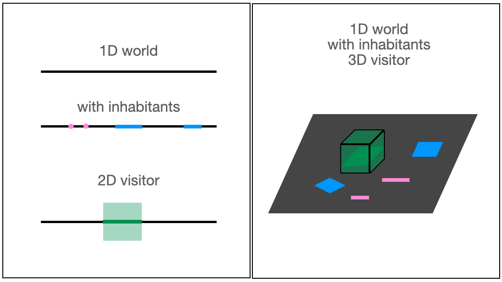

---
background-color: white
# High-dimensions in statistics

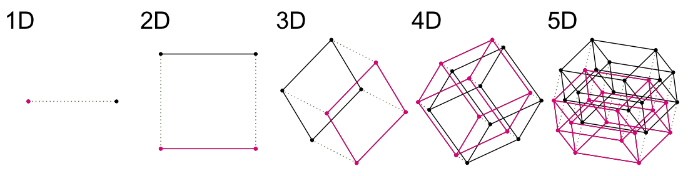

Increasing dimension adds an additional orthogonal axis. 

If you want more high-dimensional shapes there is an R package, [geozoo](http://schloerke.com/geozoo/all/), which will generate cubes, spheres, simplices, mobius strips, torii, boy surface, klein bottles, cones, various polytopes, ... 

---
# And in statistics high-D is everywhere

.pull-left[
- Principal component analysis
- Multidimensional scaling
- Factor analysis
- Projection pursuit
- Regression
]

.pull-right[
- .orange[Supervised classification]
- Clustering
- Multivariate distributions
- Posterior distributions
]

---
background-color: white
# the 4D penguins data

.small[

```{r runthis4, echo=TRUE}
library(palmerpenguins)
```

```{r}
penguins <- penguins %>% 
  filter(!is.na(bill_length_mm)) %>%
  rename("bl" = "bill_length_mm",
         "bd" = "bill_depth_mm",
         "fl" = "flipper_length_mm",
         "bm" = "body_mass_g")
```
]

.tiny[
```{r echo=FALSE}
library(DT)
datatable(penguins, options = list(pageLength = 5))
```
]

.footnote[See https://allisonhorst.github.io/palmerpenguins/ for more details.]

---

class: middle

<table>
<tr> <td width="40%">  </td> 
<td width="30%">  </td> 
<td width="30%">  </td> 
</tr>
<tr> <td> Adélie .footnote[[Wikimedia Commons](https://upload.wikimedia.org/wikipedia/commons/thumb/d/dc/Adélie_Penguin.jpg/320px-Adélie_Penguin.jpg)]  </td> 
<td> Chinstrap .footnote[[Wikimedia Commons](https://upload.wikimedia.org/wikipedia/commons/thumb/0/09/A_chinstrap_penguin_%28Pygoscelis_antarcticus%29_on_Deception_Island_in_Antarctica.jpg/201px-A_chinstrap_penguin_%28Pygoscelis_antarcticus%29_on_Deception_Island_in_Antarctica.jpg)]</td> 
<td> Gentoo .footnote[[Wikimedia Commons](https://upload.wikimedia.org/wikipedia/commons/thumb/0/04/Pygoscelis_papua_-Jougla_Point%2C_Wiencke_Island%2C_Palmer_Archipelago_-adults_and_chicks-8.jpg/273px-Pygoscelis_papua_-Jougla_Point%2C_Wiencke_Island%2C_Palmer_Archipelago_-adults_and_chicks-8.jpg)] </td> 
</tr>
</table>

---
background-color: white

.left-code[

```{r}
std <- function(x) {
  (x - mean(x))/sd(x)
}
penguins <- penguins %>%
  ungroup() %>%
  select(species, bl:bm) %>%
  mutate_if(is.numeric, std)
```

```{r echo=TRUE, eval=FALSE}
library(ochRe)
library(GGally)
ggscatmat(penguins, 
          columns = 3:6, 
          col="species") +
  scale_colour_ochre(
    palette="nolan_ned") +
  theme(aspect.ratio=1,
  legend.position="bottom")
```

What do you see? <br>
<br> clustering relative to species  
relatively similar elliptical shapes  
positive linear association
]

.right-plot[


```{r runthis5, fig.width=5, fig.height=5, out.width="120%"}
# remotes::install_github("hollylkirk/ochRe")
library(ochRe)
library(GGally)
ggscatmat(penguins, 
          columns = 2:5, 
          col="species") +
  scale_colour_ochre(
    palette="nolan_ned") +
  theme(aspect.ratio=1,
  legend.position="bottom")
```

]

---
class: inverse middle center

.white[Without any details about of the method, from this animation] 
 
# would you say that the three groups are completely separable?

---
background-color: white

.left-code[
```{r runthis6, echo=TRUE, eval=FALSE}
clrs <- ochre_pal(
  palette="nolan_ned")(3)
col <- clrs[
  as.numeric(
    penguins$species)]

animate_xy(penguins[,2:5], 
           col=col, 
           axes="off", 
           fps=15)
```
]


```{r eval=FALSE}
set.seed(20200622)
clrs <- ochre_pal(palette="nolan_ned")(3)
col <- clrs[as.numeric(penguins$species)]
render_gif(penguins[,2:5], grand_tour(), 
           display_xy(col=col, axes="bottomleft"), 
           "penguins2d.gif", frames=100, width=300, height=300)
```
.right-plot[
 
]

---
class: inverse middle 
# Tours: low-d projections of high-d

What we just saw was a grand tour

# 1985

[Asimov (1985)](https://doi.org/10.1137/0906011), Buja and Asimov (1996)


# 2011

This code implementation is available in the R package called .yellow[tourr] by [Wickham et al (2011)](https://www.jstatsoft.org/article/view/v040i02).

---
background-color: white
background-image: url(img/geodesic.png)
background-position: 110% 70%
background-size: 60%


.left-code[
# Making a tour

${\mathbf x}_i \in \mathcal{R}^p$, $i^{th}$ row of an ${\mathbf X}_{n\times p}$ data matrix.

$F$ is a $p\times d$ orthonormal basis, $F'F=I_d$, where $d$ is the projection dimension.

The projection of ${\mathbf x_i}$ onto $F$ is ${\mathbf y}_i={\mathbf x}_iF$, or of the full data matrix as ${\mathbf Y}_{n\times d} = {\mathbf XF}$.


]

.right-plot[

Tour is indexed by time, $F(t)$, where $t\in [a, z]$. Starting and target frame denoted as $F_a = F(a), F_z=F(t)$.

<br><br><br><br><br><br><br><br><br><br>
.orange[Different methods for choosing] $F_z$ .orange[provide different tours.]
]


---
class: middle

# Why do you want to use a tour?

- Explore the data as potentially arising from a specific multivariate .yellow[distribution]
- Examine .yellow[differences] between classes
- Determine .yellow[important variables], which would contribute most to a classification
- Detect .yellow[outliers], or unusual observations, that might contaminate model fitting
- Assess and compare classification .yellow[models]

---

# Guided tour 

New target bases are chosen using a projection pursuit index function

$$\mathop{\text{maximize}}_{F} g(F'x) ~~~\text{ subject to }
F \text{ being orthonormal}$$

.font_small[
- `holes`: inverse Gaussian filter, optimised by a "hole".
- `central mass`: high density in the centre, or outliers". 
- `LDA`/`PDA`: optimised when classes are most separated.
]

---
background-color: white

```{r eval=FALSE}
clrs <- ochre_pal(
  palette="nolan_ned")(3)
col <- clrs[
  as.numeric(
    penguins$species)]
set.seed(20200622)
render_gif(penguins[,2:5], guided_tour(lda_pp(penguins$species)), 
           display_xy(col=col, axes="bottomleft"), 
           "penguins2d_guided.gif", 
           frames=17, width=300, height=300, loop=FALSE)
```

```{r runthis15, eval=FALSE}
animate_xy(penguins[,2:5], grand_tour(),
           axes = "bottomleft", col=col)
animate_xy(penguins[,3:6], guided_tour(lda_pp(penguins$species)),
           axes = "bottomleft", col=col)
best_proj <- matrix(c(0.940, 0.058, -0.253, 0.767, 
                      -0.083, -0.393, -0.211, -0.504), ncol=2,
                    byrow=TRUE)
```

.left-code[
Grand


.small[
Might accidentally see best separation
]
]

.right-plot[

Guided, using LDA index

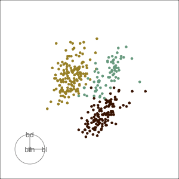

.small[
Moves to the best separation
]
]

---
background-color: white
# Manual tour

```{r eval=FALSE}
mtour1 <- manual_tour(basis = best_proj, manip_var = 3)
render_manual(penguins_s[,2:5], mtour1, "penguins_manual_fl.gif", col=col, dir = "images/manual1/")
mtour2 <- manual_tour(basis = best_proj, manip_var = 1)
render_manual(penguins_s[,2:5], mtour2, "penguins_manual_bl.gif", col=col, dir = "images/manual2")
```

.left-code[

- start from best projection, given by projection pursuit
- bl contribution controlled
- if bl is removed form projection, Adelie and chinstrap are mixed
- bl is important for Adelie

]


.right-plot[

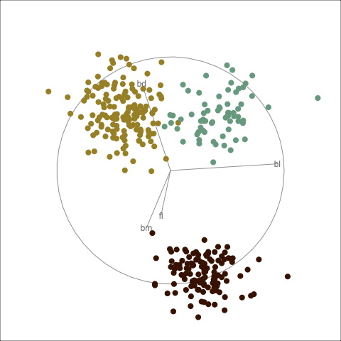

]

---
background-color: white
# Manual tour


.left-code[

- start from best projection, given by projection pursuit
- fl contribution controlled
- cluster less separated when fl is fully contributing
- fl is important, in small amounts, for Gentoo

]


.right-plot[


]

---
class: inverse middle 

# 1995

Guided tour [Cook et al (1995)](https://www.jstor.org/stable/1390844))

# 1997

Manual tour [Cook and Buja (1997)](https://www.jstor.org/stable/1390747)

# 2020

implementation re-worked into the R package called .yellow[spinifex] documented in [Spyrison and Cook (2020)](https://journal.r-project.org/archive/2020/RJ-2020-027/index.html)

---

# Today's complexities

- We often have way more than four variables, large $p$, .orange[space is BIG!]
- There are often .orange[lots of observations], slow to plot many points
- The signal in the data can be really small relative to the space

<br>

- .orange[Interactivity] in R has been lacking, and tools are only starting to emerge now. 

---
class: inverse middle 

# New developments: 2019 to now

interactivity <br>
understanding nonlinear dimension reductions <br>
handling many variables, and many observations <br>
slice tour <br>
sage tour <br>
explainable AI and manual tour<br>


---
background-color: white

.left-code[
# Interactivity

The R package [detourr](https://cran.biotools.fr/web/packages/detourr/index.html)

- generate a .orange[fixed length] of tour bases
- interactivity through specialist javascript code

.footnote[Casper Hart and Earo Wang]

]

.right-plot[

```{r eval=FALSE, echo=FALSE}
library(detourr)
library(geozoo)
library(tidyverse)
library(palmerpenguins)
penguins <- penguins %>%
  filter(!is.na(bill_length_mm)) %>%
  rename("bl" = "bill_length_mm",
         "bd" = "bill_depth_mm",
         "fl" = "flipper_length_mm",
         "bm" = "body_mass_g")

std <- function(x) {
  (x - mean(x))/sd(x)
}
penguins <- penguins %>%
  ungroup() %>%
  select(species, bl:bm) %>%
  mutate_if(is.numeric, std)

set.seed(2022)
detour(penguins,
            tour_aes(projection = where(is.numeric),
                     color = species,
                     label = species)) |>
  show_scatter(size=2, axes=TRUE)

# And use the save as a web site on the RStudio interface
```

<center>
<iframe src="detourr.html" width="800" height="600" scrolling="yes" seamless="seamless" frameBorder="0"> </iframe>
</center>

]

---
background-color: white

The R package [liminal](https://cran.r-project.org/web/packages/liminal/index.html) provides .orange[tours as streaming data] and javascript interactivity through [vegawidget](https://cran.rstudio.com/web/packages/vegawidget/index.html) interface to [VegaLite](https://vega.github.io/vega-lite/). 

.footnote[Stuart Lee (liminal); and Ian Lyttle et al (vegawidget)]


```{r eval=FALSE, echo=FALSE}
library(liminal)
limn_tour(penguins, cols = 2:5, color = species)
```

<center>
<video width="900" height="400" controls>  
  <source src="liminal.mp4">
</video>
</center>

---
background-color: white

# Nonlinear vs linear dimension reduction 

The main purpose of [liminal](https://cran.r-project.org/web/packages/liminal/index.html) is to link nonlinear dimension reductions, using methods such as tSNE or UMAP or PHATE or MDS, with tour views. 

Nonlinear dimension reduction is very popular, but can be tricky to calibrate and tune. .orange[What does the mapping do to the structure]?

<br>
<center>
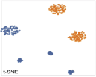
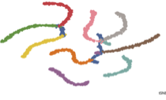
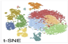
</center>

.footnote[[Lee, Cook, Laa (2022) Casting Multiple Shadows JDSSV](https://jdssv.org/index.php/jdssv/issue/current)]
---
background-color: white

<iframe title="Animation linking the tSNE plot with a tour plot, of data with 6 clusters, 2 really large, 3 very small and close together, and 1 close to the three but slightly bigger. tSNE spreads them into 6 clusters, three big and three small roughly equidistant." src="https://player.vimeo.com/video/439635905" width="120%" height="600" frameborder="0" allowfullscreen></iframe>

---
# Pre-processing

.left-code[

When the .orange[number of variables is large], reduce the dimension with principal component analysis (PCA) to ten or less. 

.purple[Example 2]: Tree data 100-D reduced to 12-D<br>
.purple[Example 3]: Single cell RNA-seq processed to 25 PCs for clustering and t-SNE, and reduced to 5-D (20% of variance) for tour. 
]

.right-plot[

For a .orange[large number of observations], sample, usually stratified. 

.purple[Example 3]: 10% stratified sample giving 4,590 observations to plot

]


---
background-color: white

<iframe title="vimeo-player" src="https://player.vimeo.com/video/439635892"  width="120%" height="600" frameborder="0" allowfullscreen></iframe>

---
class: middle
count: false

# Note the split in t-SNE is an artificial break in the data. 

---
background-color: white

<iframe title="vimeo-player" src="https://player.vimeo.com/video/439635863"  width="120%" height="600" frameborder="0" allowfullscreen></iframe>

---
class: middle
count: false

# Note the difference in the two groups in t-SNE are different branches of the tree. 

---

background-color: white

<iframe title="vimeo-player" src="https://player.vimeo.com/video/439635812"  width="120%" height="600" frameborder="0" allowfullscreen></iframe>

---
class: middle
count: false

# Note that the

- selected groups (orange, green) in t-SNE view are similarly separated in the data space, and there are a few odd observations that are similarly accurately separated in the t-SNE
- two selected green groups far apart in t-SNE view are close in the data space.

---
background-color: white

.left-code[
# Slicing

.orange[Projections suffer from over-plotting.] 

Example: Looking at the prediction boundaries for a classifier, just 3D.

It would be nice to slice through high-d, but the complication is which way do you slice.

.purple[Closer to Abbott's Flatland imagination.]
]
.right-plot[


]

.footnote[[Laa, Cook, Valencia (2020) A slice tour for finding hollowness in high-dimensional data](https://doi.org/10.1080/10618600.2020.1777140)]
---
background-color: white
# Utilize distance from the projection plane to make the slice

.left-code[

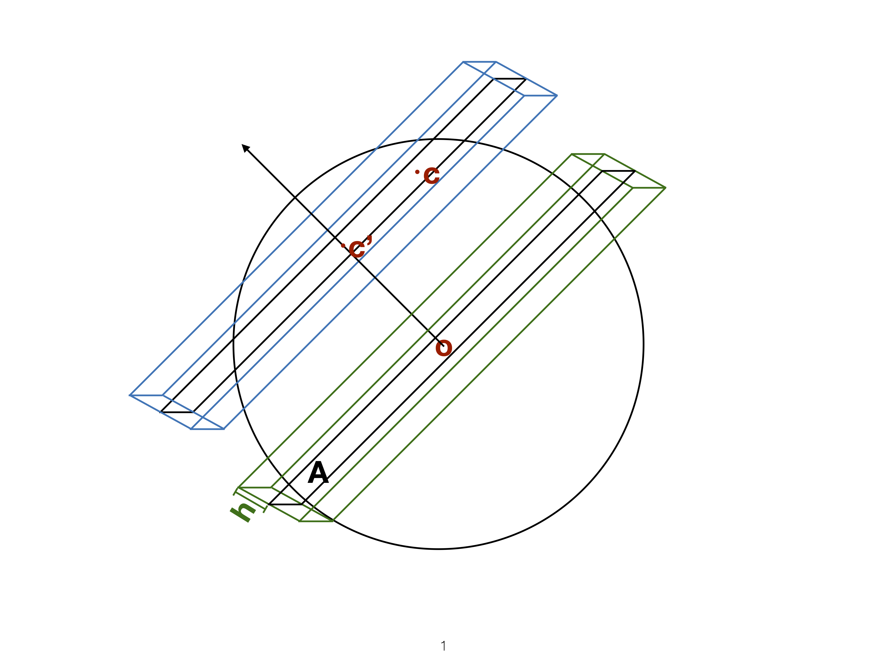


]
.right-plot[

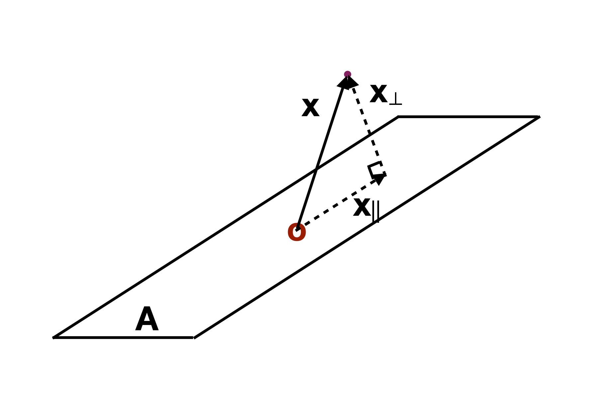

]

---
background-color: white

.left-code[
Projections


]
.right-plot[

Slices through center of data


]

---
background-color: white

.left-code[
Projections (5D)


]
.right-plot[

Slices through center of data (5D)


]

---
background-color: white

# Sage tour: reverses the curse 

<center>

</center>

Increase variables, increase concentration, possibly obscuring important structure. 

<center>
.footnote[[Laa, Cook, Lee (2022) Burning sage: Reversing the curse of dimensionality](https://doi.org/10.1080/10618600.2021.1963264)]
</center>

---
background-color: white

# Sage tour: reverses the curse 

```{r eval=FALSE, echo=FALSE}
sphere10 <- geozoo::sphere.solid.random(10)$points
colnames(sphere10) <- paste0("x", 1:10)
render_gif(sphere10, grand_tour(), display_xy(axes="bottomleft"), gif_file = "sphere.gif")
render_gif(sphere10, grand_tour(), display_sage(axes="bottomleft"), gif_file = "sphere_sage.gif")

```

<center>


</center>

Radial transformation expands the center, generating the sage display. 

---
background-color: white

<center>
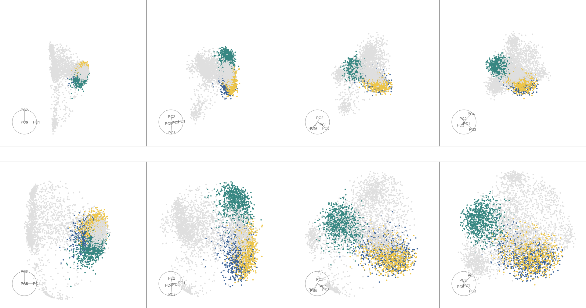
</center>

Mouse retina single cell RNA-seq data, identify and verify cluster separation, regular display (top) and sage display (bottom).

---
background-color: white
# Explainable Artificial Intelligence (XAI)

Local variable importance for the model prediction for .orange[an individual observation], through small neighbourhood perturbations (LIME), or variable order permutation (SHAP). 


<center>
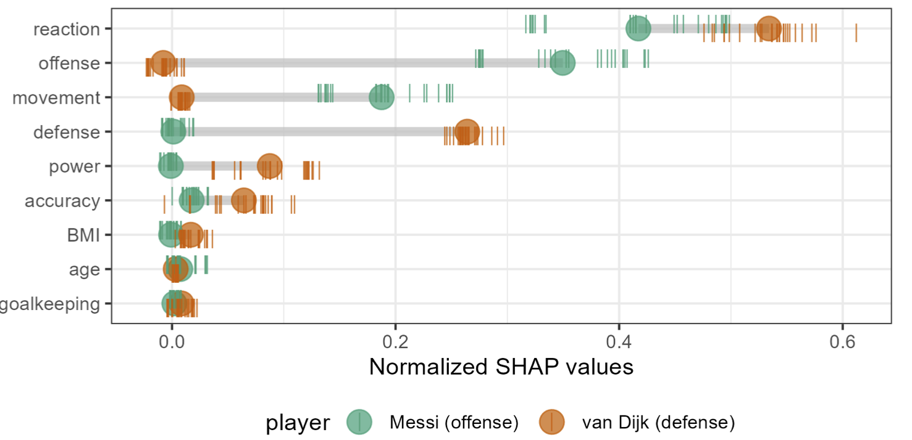
</center>

---
background-color: white
# XAI and a manual (radial) tour

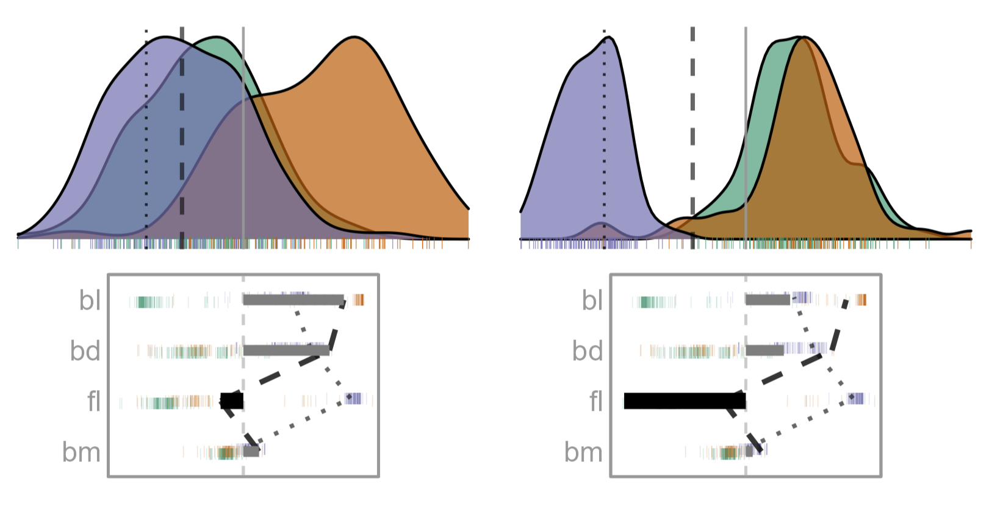

.footnote[[Spyrison, Cook, Biecek (2022)](https://github.com/nspyrison/cheem_paper)]
---
background-color: white
# XAI and a manual (radial) tour

.left-code[
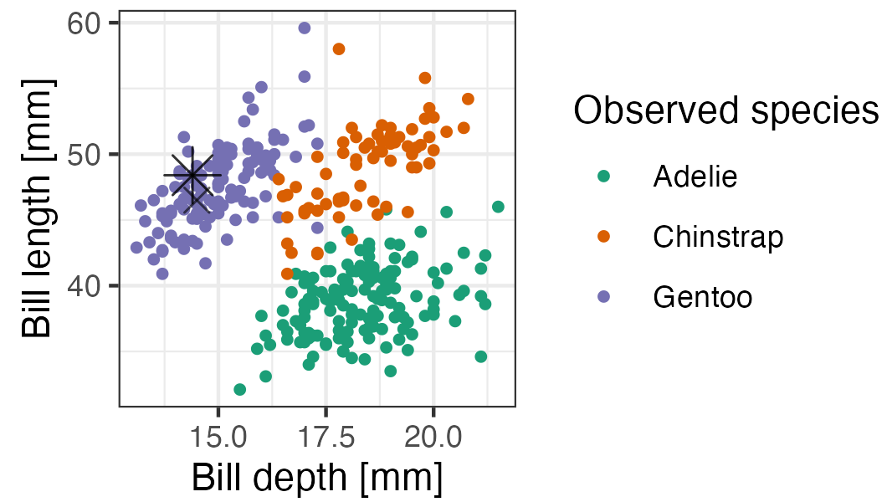

Looks like  Gentoo based on bill length and depth.


]
.right-plot[

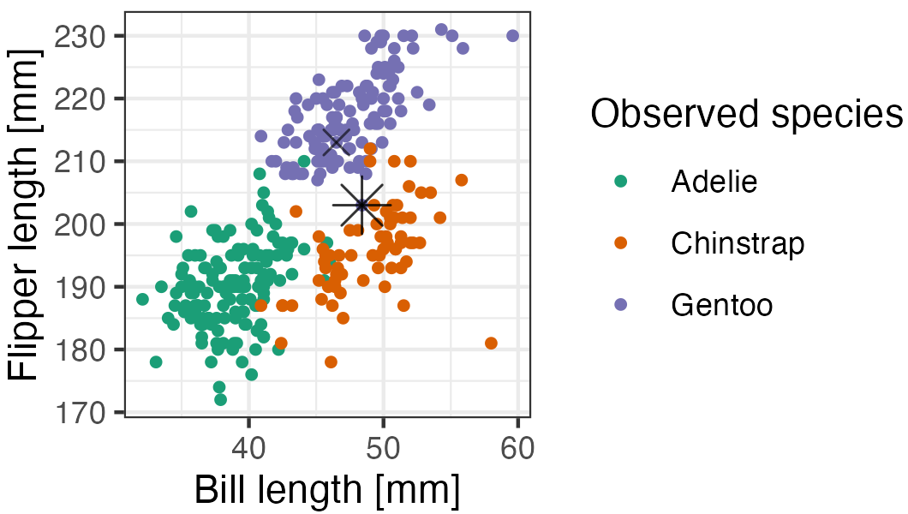

but it is a Gentoo with unusually small flippers.

]

---
class: inverse middle

# Sneak previews of yet-to-appear work

---
background-color: white


```{r eval=FALSE, echo=FALSE}
# Guided tour
library(cassowaryr)
library(tourr)
library(plotly)

# Construct data
lshape <- features %>% 
  filter(feature=="l-shape")

nonlinear2 <- features %>% 
  filter(feature=="nonlinear2")

# make tibble group a
set.seed(2022)
feature_vs_noise_A <- tibble(x1 = scale(nonlinear2$x),
                           x2 = rnorm(100, 0, 1),
                           x3 = rnorm(100, 0, 1),
                           x4 = scale(nonlinear2$y),
                           x5 = rnorm(100, 0, 1),
                           group = rep("A",100)
                           )
# Make tibble group b
feature_vs_noise_B <- tibble(x1 = rnorm(100, 0, 1),
                           x2 = rnorm(100, 0, 1),
                           x3 = rnorm(100, 0, 1),
                           x4 = rnorm(100, 0, 1),
                           x5 = rnorm(100, 0, 1),
                           group = rep("B",100)
                           )
# combine tibbles
feature_vs_noise <- bind_rows(feature_vs_noise_A,
                              feature_vs_noise_B)
#std <- function(x) (x-mean(x)/sd(x))
#feature_vs_noise <- feature_vs_noise %>% 
#  mutate_if(is.numeric, std) 

# Projection purrsuit index
scags_groups <- function(cl, scag){
  classes <- unique(cl)
  function(mat){
    #each matrix group
    group1 <- mat[which(cl==classes[1]),]
    group2 <- mat[which(cl==classes[2]),]
    
    indx <- list( #copy and pasting should be cleaned up
      "convex" = (sc_convex(x = group1[,1], y = group1[,2]) - sc_convex(x = group2[,1], y = group2[,2])),
      "monotonic" = (sc_monotonic(x = group1[,1], y = group1[,2]) - sc_monotonic(x = group2[,1], y = group2[,2])),
      "outlying" = (sc_outlying(x = group1[,1], y = group1[,2]) - sc_outlying(x = group2[,1], y = group2[,2])),
      "splines" = (sc_splines(x = group1[,1], y = group1[,2]) - sc_splines(x = group2[,1], y = group2[,2])),
      "skinny" = (sc_skinny(x = group1[,1], y = group1[,2]) - sc_skinny(x = group2[,1], y = group2[,2]))
      )
    
    #final value
    abs(indx[[scag]])
  }
}

# Run the guided tour in real-time
set.seed(2022)
animate_xy(feature_vs_noise[,1:5],
  tour_path = guided_tour(scags_groups(feature_vs_noise$group, "skinny"),
      search_f = search_better,
      alpha = 5,
      max.tries=500),
      col = feature_vs_noise$group)

# Save path, to create a plotly animation
set.seed(2022)
feature_diff <- save_history(feature_vs_noise[,1:5],
  tour_path = guided_tour(scags_groups(feature_vs_noise$group, "skinny"),
      search_f = search_better,
      alpha = 5,
      max.tries=500),
      col = feature_vs_noise$group)

# Animation, ugly code
tour_path <- interpolate(feature_diff, 0.1)
d <- dim(tour_path)
mydat <- NULL; myaxes <- NULL
for (i in 1:d[3]) {
  fp <- as.matrix(feature_vs_noise[,1:5]) %*% matrix(tour_path[,,i], ncol=2)
  fp <- tourr::center(fp)
  colnames(fp) <- c("d1", "d2")
  mydat <- rbind(mydat, cbind(fp, rep(i+10, 2*nrow(fp))))
  fa <- cbind(matrix(0, 5, 2), matrix(tour_path[,,i], ncol=2))
  colnames(fa) <- c("origin1", "origin2", "d1", "d2") 
  myaxes <- rbind(myaxes, cbind(fa, rep(i+10, 2*nrow(fa))))
}
colnames(mydat)[3] <- "indx"
colnames(myaxes)[5] <- "indx"
df <- as_tibble(mydat) %>% 
  mutate(group = rep(feature_vs_noise$group, d[3]))
dfaxes <- as_tibble(myaxes) %>%
  mutate(labels=rep(colnames(feature_vs_noise[,1:5]), d[3]))
dfaxes_mat <- dfaxes %>%
  mutate(xloc = rep(max(df$d1)+0.4, d[3]*5), 
         yloc=rep(seq(-0.6, 0.6, 0.3), d[3]), 
         coef=paste(round(dfaxes$d1, 2), ", ", 
                    round(dfaxes$d2, 2)))
p <- ggplot() +
       geom_segment(data=dfaxes, aes(x=2.5*d1-6, 
                                     xend=origin1-6, 
                                     y=2.5*d2, yend=origin2, 
                                     frame = indx),
                    colour="grey70") +
       geom_text(data=dfaxes, aes(x=2.5*d1-6, y=2.5*d2,
                                  label=labels, 
                                  frame = indx),
                 colour="grey70") +
       geom_point(data = df, aes(x = d1, y = d2, colour=group, 
                                 frame = indx), size=1) +
       scale_colour_ochre(palette = "emu_woman_paired",
                          reverse = TRUE) +
       theme_void() +
       coord_fixed() +
  theme(legend.position="none")
pg <- ggplotly(p, width=700, height=400) %>%
  animation_opts(200, redraw = FALSE, 
                 easing = "linear", transition=0)
htmltools::save_html(pg, file="scagtour.html")

# Or make the gif
set.seed(2022)
render_gif(feature_vs_noise[,1:5], 
           tour_path =  guided_tour(scags_groups(
             feature_vs_noise$group, "skinny"),
            search_f = search_better,
            alpha = 5,
            max.tries=500),
            display_xy(col = feature_vs_noise$group,
                       axes="bottomleft"), 
           "scagtour.gif", width=300, height=300)


```

<center>
<iframe src="scagtour.html" width="1000" height="480" frameBorder="0"> </iframe>
</center>

<br>
Classification based on shape differences using scagnostics

.footnote[[Mason, Lee, Laa, Cook (2022) cassowaryr R package](https://numbats.github.io/cassowaryr/)]

---

.left-code[
# Getting started

Install the `tourr` package from CRAN

```
install.packages("tourr")
```

or from GitHub

```
remotes::install_github(
  "ggobi/tourr")
```

```
library(tourr)
```

Documentation at http://ggobi.github.io/tourr


]

.right-plot[

```
# Grand tour
animate_xy(flea[, 1:6])

# Guided tour
animate_xy(flea[, 1:6], 
  guided_tour(lda_pp(flea$species)), #<<
  sphere = TRUE, 
  col = flea$species)

# Slice tour  
sphere5 <- geozoo::sphere.hollow(5)$points
colnames(sphere5) <- c("x1", "x2", "x3", "x4", "x5")
animate_slice(sphere5) 

# Sage tour
sphere10 <- geozoo::sphere.solid.random(10)$points
colnames(sphere10) <- paste0("x", 1:10)
animate_sage(sphere10) 

# Manual tour
animate_xy(flea[, 1:6], 
  radial_tour(basis_random(6, 2), 
    var = 4)) 

```


]

---
# Thanks for listening!

Here's what I hope you take away from this talk:

- it is possible to see beyond 3D
- there are new ways for touring using slices and sage transformations
- statistics is better if we keep our eyes involved.

---
### Additional reading

Wickham et al (2011) [tourr:](http://ggobi.github.io/tourr/) Explore shapes of high-dimensional data using low-dimensional projections. <br>

Spyrison and Cook (2020) [spinifex:](https://nspyrison.github.io/spinifex/) Manual tour animations. <br>

Hart and Wang (2022) [detourr:](https://cran.biotools.fr/web/packages/detourr/index.html) Animations for {tourr} using htmlwidgets for performance and portability. <br>

Harrison (2022) [Langevin dynamics based tours](https://logarithmic.net/langevitour/) of data, in Javascript with R wrapper. <br>

The [slides.Rmd](https://github.com/dicook/IFCS/blob/main/slides.Rmd) file has the .orange[R code to run most of the examples shown today]. 

---
class: inverse middle
background-image: url(img/wattle_bee.jpg)
background-position: 99% 1%
background-size: 25%

# Acknowledgements

Slides created via the R package [**xaringan**](https://github.com/yihui/xaringan), and [**xaringanExtra**](https://github.com/gadenbuie/xaringanExtra) with **wattle theme** created from [xaringanthemer](https://github.com/gadenbuie/xaringanthemer).

The chakra comes from [remark.js](https://remarkjs.com), [**knitr**](http://yihui.name/knitr), and [R Markdown](https://rmarkdown.rstudio.com).

Slides are available at [https://dicook.org/files/IFCS2022/slides.html](https://dicook.org/files/IFCS2022/slides.html) and supporting files at [https://github.com/dicook/IFCS2022](https://github.com/dicook/IFCS2022).

<a rel="license" href="http://creativecommons.org/licenses/by-sa/4.0/"></a><br />This work is licensed under a <a rel="license" href="http://creativecommons.org/licenses/by-sa/4.0/">Creative Commons Attribution-ShareAlike 4.0 International License</a>.

.footnote[Photo taken by Di Cook in 2018]
